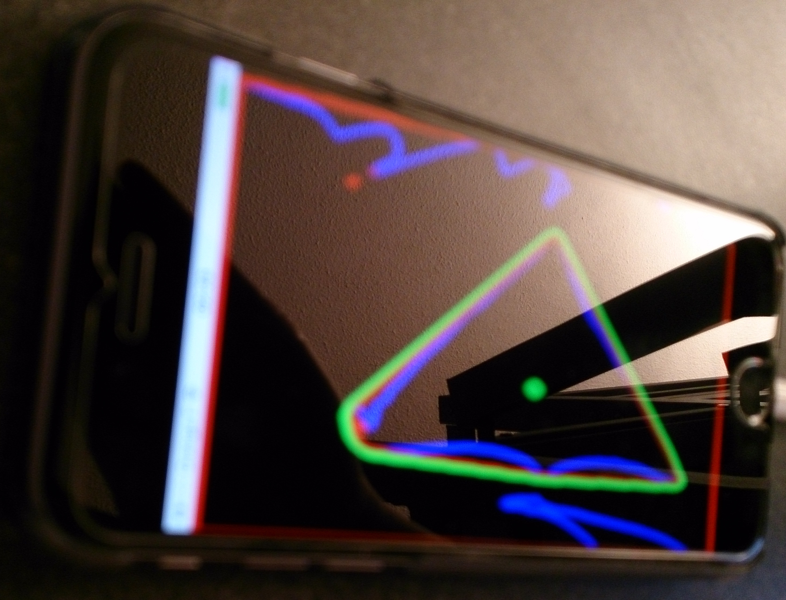

# OpenCV_iOS_RealTimeTriangleDetection
With openCV iOS : find in real time a triangle shape drawn by hands

## What are the key words ?
For this project, I had to use :
* put the image in grayscale
* blur it
* detect the edges and draw the contours and hull 
* create a new preview with a black background, the contours in blue and the hull in red
* use the preview and apply the Canny algorithm to detect geometric shapes
* check if the shape is a triangle AND if its center is at the center of the iPhone
* draw the biggest triangle in green

## How do I import openCV iOS ?

### Link Libraries
Go to Project > Build Phases > Link Binary With Libraries
* Accelerate.framework
* AssetsLibrary.framework
* AVFoundation.framework
* CoreGraphics.framework
* CoreImage.framework
* CoreMedia.framework
* CoreVideo.framework
* Foundation.framework
* QuartzCore.framework
* UIKit.framework

### Import openCV 2
Drag and drop opencv2.framework in the directory frameworks :
* check Copy the items
* check create groups 
* check add to targets "project"
* in ViewController.h add the line : "#import \<opencv2/opencv.hpp\>"
* don't forget to rename ViewController.m in ViewController.mm

### Versions

OS X : El Capitan 10.11.4

XCode : 7.3

OpenCV 3.1.0 